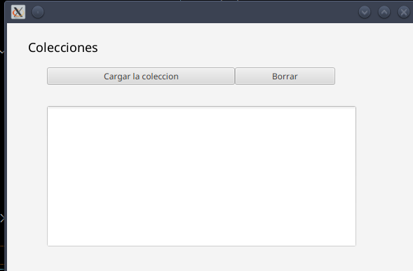
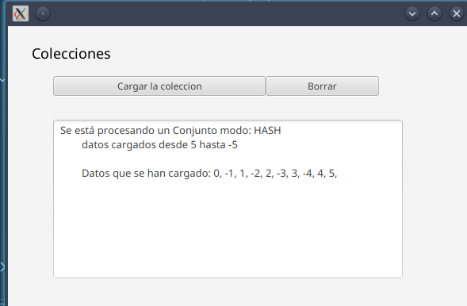

# Importante

Se necesita una versión de java 17 o superior.

Para ejecutar la aplicación se deben utilizar los comandos:

```maven
mvn clean compile
mvn javafx:run
```

Si da un error a la hora de ejecutar debido a ```location``` es necesario asegurarse que el fichero primary.fxml se encuentra dentro de la carpeta target del proyecto.

El resultado de la ejecución debe ser el siguiente:




Al ejecutar la aplicación:

